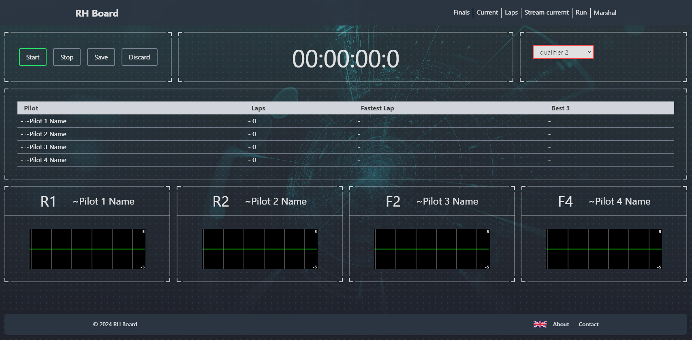

# RotorHazard Front

This is a POC for the creation of a RotorHazard interface.

The idea is to capture the RotorHazard web socket and display information, which may replace (in the future) the entire RotorHazard interface and be able to relieve the HR load.

#### Why NextJs if RH was developed in Python ?

NextJs was selected because of fullstack ability and popularity of ReactJS.

## Features planned for V1

- Run page to be able to Start/Stop race, show pilots times
- Marshall page (read-only) with a plug-in for on-the-fly replay of recent races by clicking on the graph the exact moment
- Admin pages with auth to manage Pilots,Heats,Classes
- Class generation page to generate finals from a customized ranking (such as the best of 3 non-consecutive rounds)
- All races times, with pages dedicated by pilot to see each times and rank
- Finals table on live (16 or 32 pilots tables)
- Custom pilots informations like Country, Avatar
- Next races page with each pilots and frequency to be displayed during event

## Screnshots

## Setup OBS

OBS video path should not contain spaces